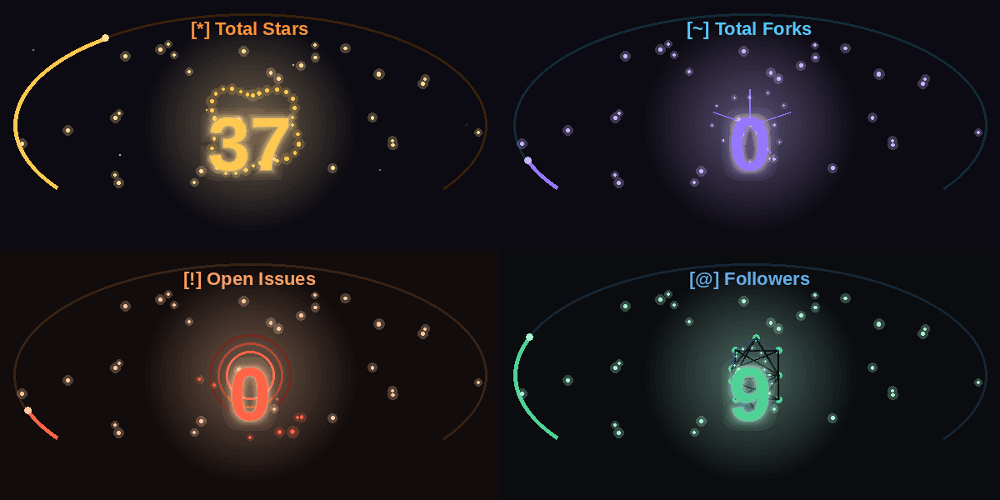

 

<em>We are only particles dancing in the quantum foam of existence</em>

  

  

 

<picture>
  
</picture>

 

## 📊 &nbsp;Metrics

 

<picture>
  
</picture>

 

## 📈 &nbsp;GitHub Statistics

 

 

<picture>
  
</picture>

 

## 🔭 &nbsp;Profile Metrics

<!-- Generated weekly by .github/workflows/metrics.yml -->
<!-- Run the workflow manually once to generate assets/metrics.svg -->

 

<picture>
  
</picture>

 

## 🐍 &nbsp;Contributions

<picture>
  <source media="(prefers-color-scheme: dark)" srcset="assets/github-contribution-grid-snake-dark.svg" />
  <source media="(prefers-color-scheme: light)" srcset="assets/github-contribution-grid-snake.svg" />
  
</picture>

 

<!-- CHESS_METRICS -->
<!-- Uncomment after workflow runs: assets/metrics-chess.svg will appear here -->
<!--  -->
<!-- /CHESS_METRICS -->

 

<picture>
  
</picture>

 

## 🛠 &nbsp;Stack

<table border="0" cellpadding="14" cellspacing="0">
  <tr>
    <td align="center">
      <b>Languages</b>  
      
    </td>
    <td align="center">
      <b>ML · Signal · Vision</b>  
      
    </td>
  </tr>
  <tr>
    <td align="center" colspan="2">
      <b>Infrastructure &amp; Tools</b>  
      
    </td>
  </tr>
</table>

 

<picture>
  
</picture>

 

## 📡 &nbsp;Connect

  

&ensp;

  

 

