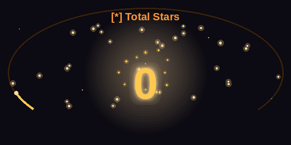
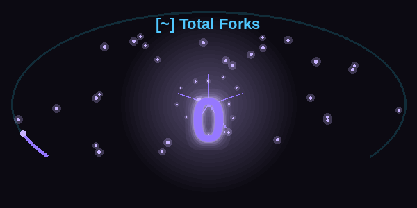
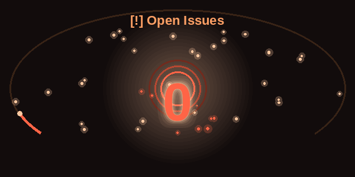
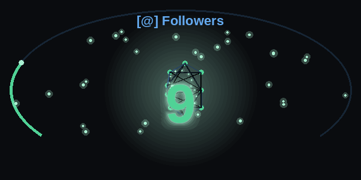

  

  

<a href="https://mburgc.github.io/" target="_blank" style="text-decoration:none;">
  <strong><em>We are only particles dancing in the quantum foam of existence</em></strong>
</a>

  

Explorations in computation, physics, cognition and signal — 
documented beyond GitHub.

  

&ensp;

 

 

## 🏆 &nbsp;Trophies

 

 

## 📊 &nbsp;GitHub Profile Metrics

<table align="center" border="0" cellpadding="0" cellspacing="0">
  <tr>
    <td align="center" width="50%">
      
    </td>
    <td align="center" width="50%">
      
    </td>
  </tr>
  <tr>
    <td align="center" width="50%">
      
    </td>
    <td align="center" width="50%">
      
    </td>
  </tr>
</table>

 

 

## 📈 &nbsp;GitHub Statistics

&nbsp;

  

 

 

## 🐍 &nbsp;Contribution Activity

<picture>
  <source media="(prefers-color-scheme: dark)" srcset="assets/github-contribution-grid-snake-dark.svg" />
  <source media="(prefers-color-scheme: light)" srcset="assets/github-contribution-grid-snake.svg" />
  
</picture>

 

 

 

## 🛠 &nbsp;Stack

**Languages & Core**

**ML · Signal · Computation**

**Infrastructure & Tools**

 

 

## 📫 &nbsp;Connect

  

 

